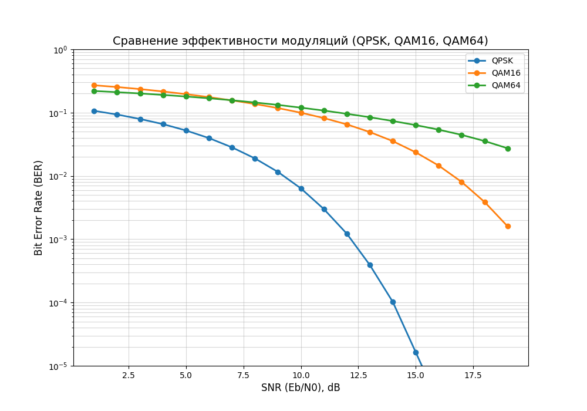

# Modulation Simulation Project (QPSK, QAM16, QAM64)


## Реализация
*   **Модуляции**: QPSK, QAM16, QAM64.
*   **Маппинг**: Использование кода Грея для минимизации BER.
*   **Оптимизация**: Параллельные вычисления с использованием **OpenMP**.
*   **Сборка**: Автоматизирована через **CMake**.
*   **Визуализация**: Скрипт на Python для построения графиков в логарифмическом масштабе.

## Структура проекта
```text
YADRO_2026_MODULATOR/
├── include/              # Заголовочные файлы (.h)
│   ├── modulator.h       # Класс модулятора
│   ├── demodulator.h     # Класс демодулятора
│   ├── gaussian_noise.h  # Модель AWGN канала
│   └── utils.h           # Константы созвездий (QPSK, QAM16, QAM64)
├── src/                  # Реализация методов (.cpp)
│   ├── modulator.cpp
│   ├── demodulator.cpp
│   └── gaussian_noise.cpp
├── plot_results/         # Визуализация данных
│   └── plot.py           # Python-скрипт для отрисовки графиков BER
├── CMakeLists.txt        # Сценарий сборки проекта
├── main.cpp              # Основной цикл симуляции
├── ber_plot.png          # Результирующий график (генерируется)
├── .gitignore            # Исключение временных файлов
└── README.md             # Документация проекта
```

## Требования
*   Компилятор C++ с поддержкой стандарта **C++17** и **OpenMP**.
*   **CMake** версии 3.10 или выше.
*   **Python 3.x** с библиотеками `pandas` и `matplotlib` (для графиков).

## Сборка и запуск

### 1. Сборка проекта
```bash
mkdir build
cd build
cmake ..
cmake --build .
```

### 2. Запуск симуляции
После сборки запустите исполняемый файл из папки `build`:
```bash
./simulation
```

### 3. Отрисовка графиков
Выйдите в корень проекта и запустите скрипт:
```bash
python plot_results/plot.py
```

## Математическая модель
В проекте реализован расчет средней мощности сигнала для корректного задания уровня шума согласно формуле:
$$SNR_{linear} = 10^{\frac{SNR_{dB}}{10}}$$
$$P_{noise} = \frac{P_{signal}}{SNR_{linear}}$$

Для каждой точки созвездия применяется поиск ближайшего соседа (Hard Decision) по критерию минимума Евклидова расстояния.

## Пример графика
После выполнения симуляции вы получите файл `ber_plot.png`, отображающий зависимость BER от SNR для всех типов модуляции.


## Созвездия
Понимаю что реализовывать созвездия через массив не очень логично. Правильнее было бы через формулы, которые сохраняют 'Коды Грея'.
Для QPSK и QAM16 через массивы ещё нормально (мало значений), но для QAM64, QAM256 и так далее уже нет (фактор человеческой ошибки).
Как я понял, там надо разделять последовательность бит на I и Q, переводить в десятичное число и использовать математические свойства кодов Грея.

## Декодер
Реализован через Евклидово расстояние - жёсткое решение.